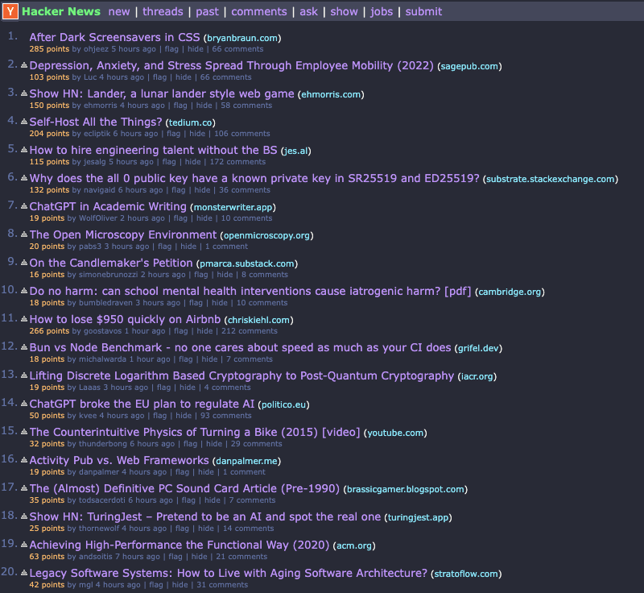

# HN-Dracula

> A dark theme for [Hacker News](https://news.ycombinator.com/).

## Install

- Install [Stylus](https://github.com/openstyles/stylus)
- [Click here](https://github.com/jasperpilgrim/hn-dracula/raw/main/hn-dracula.user.css) and Stylus will prompt you to install the theme
- That's it. Enjoy!

## About

Forked from [Dracula for Hacker News](https://github.com/dracula/hacker-news). Updated for more consistent theming and readability.

## License

[MIT License](./LICENSE)
